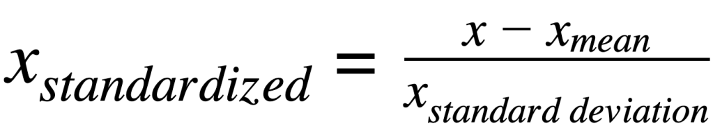
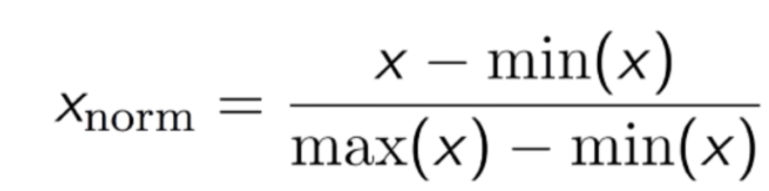

# ML_Preparation
# Introduction

Data preparation is an important step in the Machine Learning process. It focuses on prepare the data to be best utilized by the Algorithm. As some algorithms needs specific types of data, some changes need to be done to the dataset, in order to guarantee the proper model training. 
It can be separated into Data Selection and Data Engineering.  


## Data Engineering
Data engineering is a process to create more columns on the dataset, to be used by the Machine Learning Algorithms.
Even though Machine Learning algorithms vary in behavior, most of the time, when you use too many features to train a model, you can get worse answers. It affects more some models than others, even so, it is often important to reduce the numbers of features used to best describe the problem. 
On that sense, an example of data engineering is the Summarization, that prepares the data by creating more columns, to summarize the data. After the creation, the former columns can be deleted. In the end, the dataset would have less features, but the problem would still have the same quantity of information.  An example of data summarization could be, in a model that tries to describe a person’s metabolism using the heigh and weight of this person as features, might summarize this column using the “Body Mass Index (BMI)” instead, that is calculated using both weight and height. Then even after deleting those two columns, the persons information would still be inside the BMI column, so numbers of features would be lower, but information would be maintained. 
It is important to note that, even though summarization can be good for the model, it also can compromise results, depending on the given problem to be solved. Therefore, how one should prepare the data should be tested, and not take for granted that a method is a silver bullet to solve every king of problem.
Data scaling is another example of Data Engineering, as it creates new columns that have some feature in the same scale. It can be important to assure that the model won’t over consider one feature over another, for being in a higher scale. There are two main types of Data Scaling    being Standarization and Normalization.


- Standarization
Standarization converts the data into a standard format, that grants an average value of 0, and the standard deviation value of 1.  It uses the Z-score formula as follows:




- Normalization
Normalization reorganizes the data in a cleaner form. It grants that the data values would be between 0 and 1. The formula for normalization is:



## Data Selection
Data selection involves select the data to get only the best information to train the model. Remove columns such as a “Name”, or “User Id” of the dataset is an example of Feature Selection. Both name and user Id are irrelevant for a model prediction, so removing it is always a good practice. Data selection can also prevent Biases on the Model. Removing “Gender” or “Nationality” in a model that predicts the chance of someone committing a crime can be good to assure that the model wouldn’t be discriminating people by those features, granting fairness and scaping moral dilemmas. 


# Dependencies

This repository will use dependencies to generate plots, and their documentation can be checked for more info. 
 - [Matplotlib](https://matplotlib.org/3.5.3/index.html) : Graphs created with seaborn will have a _sns sulfix.
 - [Seaborn](https://seaborn.pydata.org/) : Graphs created with seaborn will have a _sns sulfix.
 - [Plotly](https://plotly.com/python/) : Graphs created with plotly will have a _px sulfix.
 - [Pandas](https://pandas.pydata.org/) : Graphs created with plotly will have a _pd sulfix.

# Using this project
## To start project:

````
python -m venv venv

.\venv\Scripts\Activate.ps1

pip install -r requirements.txt
````

## To exit virtual environment:

````
deactivate
````

## To install dependency:

````
pip install dependency
pip freeze > requirements.txt
````